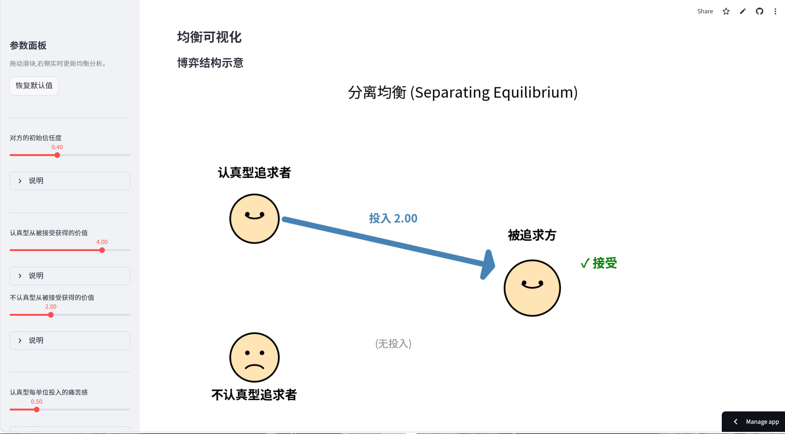

# dating-signaling-game

> Spence (1973) 信号博弈理论在恋爱场景下的可视化实现 ── 应用数学专业本科生兴趣作品

[](https://www.python.org/)
[](https://streamlit.io/)
[](LICENSE)

---

## 在线访问

🔗 **[Streamlit Demo](https://dating-signaling-game-d86otzuv8fea3revx5wcds.streamlit.app/)**

> 部署平台:Streamlit Community Cloud (国内访问可能需要科学上网)

---

## 项目简介

本项目以 Michael Spence 1973 年提出的信号博弈理论为基础,在恋爱追求场景下演示该模型的均衡解。Spence 因这一研究于 2001 年获得诺贝尔经济学奖,其核心洞察是:**当一种行为对不同动机的人代价不同时,这种行为本身可以成为可信的信号**。

理论的原始应用是劳动力市场中的教育信号问题,但其抽象的博弈结构能解释任何「一方拥有私有信息、另一方依据可观察行为做推断」的场景。本项目以恋爱为例,演示该机制的三种均衡形式:

- **分离均衡 (Separating Equilibrium)** ── 真心人通过"过度投入"使自己被识别
- **混同均衡 (Pooling Equilibrium)** ── 高信任市场中信号失效
- **半分离均衡 (Semi-Separating Equilibrium)** ── 即「备胎现象」的精确数学解释

通过拖动参数滑块,用户可以实时观察均衡如何随条件变化,并理解几个常见的恋爱现象(如「为什么追了很久才在一起的关系往往更稳定」、「为什么对方的忽冷忽热会强化判断难度」)在博弈论框架下的精确意义。

---

## 功能预览



---

## 本地运行

### 环境要求

- Python 3.9 或更高
- pip

### 安装与启动

```bash
# 1. 克隆仓库
git clone https://github.com/EddieR314/dating-signaling-game.git
cd dating-signaling-game

# 2. 安装依赖
pip install -r requirements.txt

# 3. 启动应用
streamlit run app_v2.py
```

启动后浏览器自动打开 `http://localhost:8501`。

### 跑测试

核心算法部分有完整的单元测试覆盖:

```bash
pip install pytest
python -m pytest test_equilibrium.py -v
```

预期输出:**20 passed**。

---

## 项目结构

```
dating-signaling-game/
├── equilibrium.py          # 均衡求解核心算法 (PBE + Cho-Kreps 精炼)
├── test_equilibrium.py     # 单元测试 (20 个测试用例)
├── app_v2.py               # Streamlit 可视化应用
├── requirements.txt        # 依赖清单
└── README.md
```

---

## 数学模型概要

设博弈双方为发送者 A (追求方) 与接收者 B (被追求方)。

- **类型空间**: A 的私有类型 t ∈ {S, C}，先验 P(t=S) = p₀
- **信号空间**: A 选择投入度 s ∈ [0, +∞)
- **效用**:
  - U_A(t, s, a) = a · b(t) − c(t) · s
  - U_B(t, a) = a · v(t)
- **关键假设**: Single-Crossing Condition，c(S) < c(C)
- **求解方法**: 完美贝叶斯均衡 (PBE) + Cho-Kreps 直觉准则精炼

三种均衡的存在条件:

| 均衡形式 | 存在条件 | 关键参数 |
|---------|----------|---------|
| 分离均衡 | SCC 成立 | s* = b(C)/c(C) |
| 混同均衡 | p₀ > μ* | μ* = −v(C) / (v(S) − v(C)) |
| 半分离均衡 | SCC 成立 且 p₀ < μ* | q = p₀(1−μ*) / ((1−p₀)μ*) |
---

## 路线图

- [x] **v1**: 单边静态信号博弈,三种均衡的判别与可视化
- [ ] **v1.5**: 中英文双语切换
- [ ] **v2**: 双边信号博弈 (双方均存在私有信息)
- [ ] **v3**: 动态多期博弈 (序贯均衡)
- [ ] **v4**: 群体演化博弈 (复制动态)

---

## 参考文献

1. Spence, M. (1973). "Job Market Signaling." *Quarterly Journal of Economics* 87(3): 355-374.
2. Cho, I.-K., & Kreps, D. M. (1987). "Signaling Games and Stable Equilibria." *Quarterly Journal of Economics* 102(2): 179-221.
3. Sobel, J. (2009). "Signaling Games." In *Encyclopedia of Complexity and Systems Science*.
4. Mas-Colell, A., Whinston, M. D., & Green, J. R. (1995). *Microeconomic Theory*, Chapter 13. Oxford University Press.

---

## 免责声明

本项目为应用数学专业一年级本科生的兴趣作品。模型采用大量简化假设(离散两类型、一维信号、线性效用、单期博弈、完全理性),旨在演示博弈论对现实场景的解释力,**不构成任何恋爱建议**。

模型的局限性详见应用内「模型局限」面板。

---

## 许可证

MIT License
